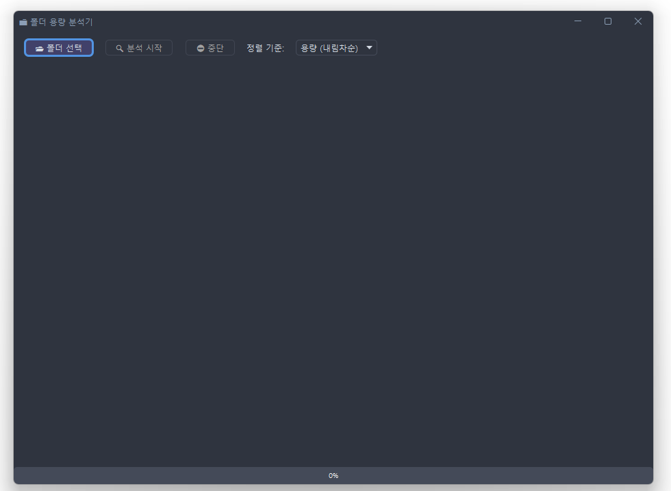

# 📁 SpaceScope

**SpaceScope**는 폴더 용량을 시각적으로 분석하고,  
트리 형태로 구조화된 결과를 CSV 파일로 내보내는 Java 기반 GUI 프로그램

---

## 🚀 주요 기능

- 📂 **폴더 용량 분석** – 모든 하위 폴더 포함
- 🌲 **트리 구조 시각화** – 계층적 폴더 구조 표시
- 📊 **진행률 표시** – 분석 중 실시간 진행 상태 갱신
- 💾 **CSV 내보내기** – UTF-8 with BOM 형식으로 저장
- 🎨 **모던 다크 테마 UI** – [FlatLaf](https://www.formdev.com/flatlaf/) 기반
- ⚙️ **설치형 프로그램 제공** – JDK 없이 바로 실행 가능 (v1.0.0 이상)

---

## 🧩 기술 스택

| 분류 | 사용 기술 |
|------|------------|
| Language | Java 17 |
| UI | Swing + FlatLaf |
| Concurrency | ForkJoinPool (병렬 폴더 크기 계산) |
| Export | CSV |
| Installer | Inno Setup |
| IDE | IntelliJ IDEA |

---

## 🖥️ 실행 방법

### ✅ 설치형(EXE) 실행 (권장)
> **버전 1.0.0 이상에서는 Java 설치가 필요 없습니다.**

1. `SpaceScope_Installer_v1.0.0.exe` 실행
2. 설치 중 원하는 옵션 선택
    - [✔] 바탕화면에 바로가기 만들기
    - [✔] 시작 메뉴에 바로가기 만들기
3. 설치 완료 후 **자동 실행** 또는 **바탕화면 아이콘 더블클릭**

---

## 🆙 버전별 변경 이력 (CHANGELOG)

| 버전 | 날짜 | 주요 변경사항 | 다운로드 |
|------|------|----------------|-----------|
| **v1.0.0** | 2025-10-22 | 🚀 첫 정식 릴리스 - 설치형 인스톨러 추가 (Inno Setup) - JDK 없이 실행 가능한 독립 환경 구성 - 바탕화면 / 시작 메뉴 바로가기 옵션 추가 - CSV 내보내기 기능 개선 | [⬇️ Download](https://github.com/jaehoonV/SpaceScope/releases/download/v1.0.0/SpaceScope_Installer_v1.0.0.exe) |
| **v0.9.0** | 2025-10-20 | 🧩 초기 개발 버전 - 폴더 용량 분석 및 트리 구조 출력 - CSV 내보내기 기능 추가 - FlatLaf 다크 테마 적용 | — |

---

## 📜 라이선스
이 프로젝트는 [MIT License](LICENSE) 하에 배포됩니다.
